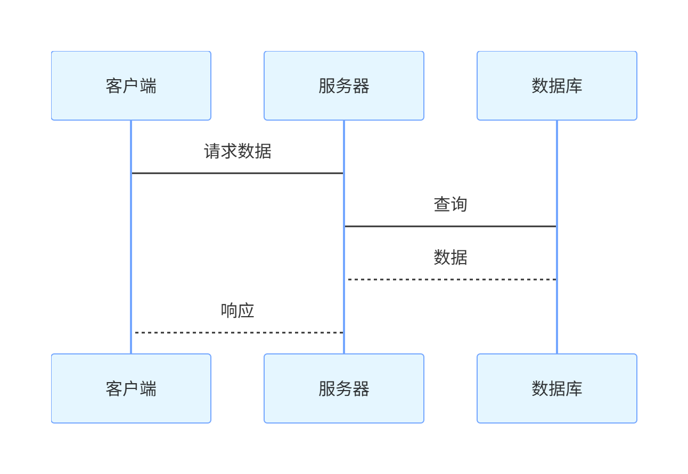

# ui.mermaid 全面详解

`ui.mermaid` 是 NiceGUI 中用于渲染 Mermaid 语法图表的专用组件，支持流程图、时序图、饼图等多种图表类型，通过简洁的文本语法快速生成可视化图表。该组件继承自 `ui.element` 基类，具备动态更新、事件监听、样式自定义等核心能力，同时支持与 Markdown 组件联动使用，适用于数据可视化、流程展示、架构图绘制等场景。

## 一、核心定位与初始化参数

### 1. 核心定位

- Mermaid 语法解析：直接解析 Mermaid 文本语法，无需额外配置，自动渲染为交互式图表；
- 多图表类型支持：兼容 Mermaid 官方所有图表类型（流程图、时序图、饼图、类图等）；
- 交互能力丰富：支持节点点击事件、自定义配置（如安全级别、日志级别）、错误处理；
- 灵活集成：可独立使用，也可通过 `ui.markdown` 的 `extras=['mermaid']` 参数嵌入 Markdown 内容中。

### 2. 初始化参数

| 参数名        | 类型与说明                                                   | 默认值 | 关键注意事项                                                 |
| ------------- | ------------------------------------------------------------ | ------ | ------------------------------------------------------------ |
| content       | 待渲染的 Mermaid 语法文本（字符串）                          | -      | 核心必填参数，需遵循 Mermaid 语法规范，支持所有官方图表类型  |
| config        | Mermaid 初始化配置字典（传递给 `mermaid.initialize()`）      | `{}`   | 用于设置安全级别、日志级别、主题等，完整配置见 [Mermaid 官方文档](https://mermaid-js.github.io/mermaid/#/Setup) |
| on_node_click | 节点点击回调函数（参数为 `MermaidNodeClickEventArguments` 对象） | None   | 3.3.0+ 新增，用于监听节点点击事件，返回点击节点 ID 等信息    |

### 基础使用示例

```python
from nicegui import ui

# 1. 基础流程图（横向）
ui.mermaid('''
    graph LR;
        A[开始] --> B[处理步骤 1];
        B --> C{判断条件};
        C -->|是| D[结果 A];
        C -->|否| E[结果 B];
        D --> F[结束];
        E --> F;
''')

# 2. 带配置的饼图（设置安全级别）
ui.mermaid('''
    pie
        title 数据分布统计
        "类别 1" : 35
        "类别 2" : 45
        "类别 3" : 20
''', config={'securityLevel': 'strict', 'logLevel': 'warn'})

ui.run()
```

## 二、核心功能与使用场景

### 1. 支持的 Mermaid 图表类型

`ui.mermaid` 兼容 Mermaid 官方所有图表类型，以下是常用类型示例：

#### （1）流程图（Graph）

支持横向（LR）、纵向（TD/BT）、横向反转（RL）等布局，节点支持自定义形状、颜色。

**示例**：

```python
from nicegui import ui

ui.mermaid('''
    graph TD;
        A((圆形节点)) --> B[矩形节点];
        B --> C{菱形判断};
        C -->|选项 1| D[[子程序节点]];
        C -->|选项 2| E>起始/结束节点];
        D --> F((结束));
        E --> F;
        style A fill:#f9f,stroke:#333,stroke-width:2px;
        style B fill:#9ff,stroke:#333,stroke-width:2px;
''')

ui.run()
```

#### （2）时序图（Sequence Diagram）

用于展示对象间的交互时序，支持异步调用、循环、条件判断。

**示例**：

```python
from nicegui import ui

ui.mermaid('''
    sequenceDiagram
        participant 客户端
        participant 服务器
        participant 数据库

        客户端->>服务器: 发送请求（GET /data）
        activate 服务器
        服务器->>数据库: 查询数据
        activate 数据库
        数据库-->>服务器: 返回数据
        deactivate 数据库
        服务器-->>客户端: 响应结果（200 OK）
        deactivate 服务器

        note over 客户端,数据库: 整个流程耗时 50ms
''')

ui.run()
```

#### （3）饼图（Pie Chart）

用于数据占比展示，支持自定义颜色、标签。

**示例**：

```python
from nicegui import ui

ui.mermaid('''
    pie
        title 项目资源分配
        "开发" : 40
        "设计" : 25
        "测试" : 20
        "文档" : 15
        style 开发 fill:#ff7e00
        style 设计 fill:#1e40af
        style 测试 fill:#10b981
        style 文档 fill:#8b5cf6
''')

ui.run()
```

#### （4）类图（Class Diagram）

用于展示类的继承关系、属性和方法，支持接口、抽象类。

**示例**：

```python
from nicegui import ui

ui.mermaid('''
    classDiagram
        class 动物{
            + 名称: string
            + 年龄: int
            + 进食()
            + 移动()
        }
        class 狗 extends 动物{
            + 品种: string
            + 吠叫()
        }
        class 猫 extends 动物{
            + 毛色: string
            + 抓挠()
        }
        动物 <<|-- 狗
        动物 <<|-- 猫
''')

ui.run()
```

### 2. 节点点击事件处理

支持两种点击事件处理方式：`on_node_click` 回调（Python 侧）和 JavaScript 指令（客户端侧）。

#### （1）Python 回调（3.3.0+ 支持）

通过 `on_node_click` 参数绑定回调函数，获取点击节点的 ID 等信息。

**示例**：

```python
from nicegui import ui

def on_click(e):
    # e.node_id 为点击节点的 ID
    ui.notify(f'点击了节点：{e.node_id}')

ui.mermaid('''
    graph LR;
        A[首页] --> B[产品列表];
        B --> C[产品详情];
        C --> D[购物车];
        D --> E[结算];
''', on_node_click=on_click)

ui.run()
```

#### （2）JavaScript 指令（需配置安全级别）

通过 Mermaid 的 `click` 指令绑定 JavaScript 逻辑，需设置 `config={'securityLevel': 'loose'}` 允许 JS 执行。

**示例**：

```python
from nicegui import ui

ui.mermaid('''
    graph LR;
        X[弹出 JS 提示] --> Y[触发 NiceGUI 通知];
        Z[无操作节点] --> Y;
        
        # 绑定 JS 原生 alert
        click X call alert("你点击了 X 节点！")
        # 绑定 NiceGUI 事件（通过 emitEvent 传递到 Python 侧）
        click Y call emitEvent("mermaid_click", "Y 节点被点击")
''', config={'securityLevel': 'loose'})

# 监听自定义事件 "mermaid_click"
ui.on('mermaid_click', lambda e: ui.notify(f'收到事件：{e.args}'))

ui.run()
```

**注意**：

- `securityLevel: 'loose'` 允许执行 JavaScript，存在安全风险，禁止渲染未信任的 Mermaid 内容；
- 多图表场景下，需确保节点 ID 唯一，避免点击事件绑定错误。

### 3. 错误处理

通过监听 `error` 事件，捕获 Mermaid 语法错误、渲染失败等异常，获取错误信息（如错误消息、哈希值）。

**示例**：

```python
from nicegui import ui

# 故意编写错误语法（缺少箭头连接）
mermaid = ui.mermaid('''
    graph LR;
        A[节点 1]
        B[节点 2]  # 错误：未与其他节点连接，语法不完整
''')

# 监听错误事件
mermaid.on('error', lambda e: ui.notify(f'渲染失败：{e.args["message"]}', type='negative'))

ui.run()
```

### 4. 动态更新图表内容

支持通过 `content` 属性或 `set_content` 方法动态修改 Mermaid 语法，实现图表实时刷新。

**示例**：

```python
from nicegui import ui

# 创建图表并保存引用
mermaid = ui.mermaid('''
    graph LR;
        A --> B;
        B --> C;
''')

# 切换为纵向流程图
def switch_to_vertical():
    mermaid.set_content('''
        graph TD;
        A --> B;
        B --> C;
        C --> D;
    ''')

# 切换为饼图
def switch_to_pie():
    mermaid.set_content('''
        pie
            title 动态切换图表
            "A" : 30
            "B" : 40
            "C" : 30
    ''')

# 按钮控制切换
with ui.row():
    ui.button('切换为纵向流程图', on_click=switch_to_vertical)
    ui.button('切换为饼图', on_click=switch_to_pie)

ui.run()
```

### 5. 嵌入 Markdown 内容

通过 `ui.markdown` 的 `extras=['mermaid']` 参数，可在 Markdown 文本中直接嵌入 Mermaid 图表，无需单独使用 `ui.mermaid`。

**示例**：

~~~python
from nicegui import ui

ui.markdown('''
# Markdown 中嵌入 Mermaid 图表
以下是流程图示例：

```mermaid
graph LR;
    1[开始] --> 2[处理];
    2 --> 3[结束];
''', extras=['mermaid']) # 启用 mermaid 扩展

ui.run()
~~~

以下是时序图示例：



### 6. 自定义配置（config 参数）
`config` 参数传递给 `mermaid.initialize()`，支持配置安全级别、日志级别、主题、图表尺寸等。

**常用配置示例**：
```python
from nicegui import ui

# 自定义主题、日志级别、安全级别
custom_config = {
    'securityLevel': 'strict',  # 严格模式（禁止 JS 执行，默认）
    'logLevel': 'info',         # 日志级别：trace/debug/info/warn/error/fatal
    'theme': 'dark',            # 主题：default/dark/forest/neutral
    'themeVariables': {         # 自定义主题变量（颜色、字体等）
        'primaryColor': '#ff7e00',
        'lineColor': '#1e40af',
        'fontSize': '14px'
    },
    'width': '800',             # 图表宽度
    'height': '400'             # 图表高度
}

ui.mermaid('''
    graph LR;
        A[主题演示] --> B[深色主题];
        B --> C[自定义颜色];
''', config=custom_config)

ui.run()
```

## 三、组件属性

`ui.mermaid` 继承自 `ui.element`，除基础属性外，新增 `content` 绑定属性，支持动态同步图表内容：

| 属性名  | 类型             | 说明                                                   | 适用场景                     |
| ------- | ---------------- | ------------------------------------------------------ | ---------------------------- |
| content | BindableProperty | Mermaid 语法文本（可绑定到其他对象属性，支持双向同步） | 动态更新图表、状态同步       |
| classes | Classes[Self]    | 组件的 CSS 类（Tailwind/Quasar 类），用于整体样式调整  | 图表布局、边距、边框配置     |
| style   | Style[Self]      | 内联 CSS 样式，用于精细化样式调整                      | 图表尺寸、对齐方式、背景色   |
| html_id | str              | HTML DOM 元素 ID（NiceGUI 2.16.0+ 新增）               | 原生 JS 交互、CSS 选择器定位 |
| visible | BindableProperty | 组件可见性（布尔值，支持绑定）                         | 条件显示 / 隐藏图表          |

### 属性使用示例（内容绑定）

```python
from nicegui import ui

# 定义状态类
class AppState:
    def __init__(self):
        self.mermaid_content = '''
            graph LR;
                A --> B;
            '''

state = AppState()

# 图表内容双向绑定到 state.mermaid_content
mermaid = ui.mermaid('').bind_content(state, 'mermaid_content')

# 输入框修改内容，同步到图表
ui.textarea(
    label="编辑 Mermaid 语法",
    value=state.mermaid_content,
    rows=5,
    on_change=lambda e: setattr(state, 'mermaid_content', e.value)
).classes('w-full mt-4')

ui.run()
```

## 四、核心方法

除继承 `ui.element` 的所有方法（如 `move`、`delete`、`tooltip` 等）外，`ui.mermaid` 新增专属方法用于事件绑定和内容操作：

| 方法名                  | 参数与说明                                                   | 功能描述                                                     |
| ----------------------- | ------------------------------------------------------------ | ------------------------------------------------------------ |
| set_content(content)    | content: 新的 Mermaid 语法文本                               | 手动设置图表内容（动态更新）                                 |
| on_node_click(callback) | callback: 节点点击回调函数                                   | 绑定节点点击事件（3.3.0+ 支持，等效于初始化参数 `on_node_click`） |
| bind_content            | target_object: 目标对象；target_name: 属性名；forward/backward: 转换函数 | 内容双向绑定到目标对象属性（组件 ↔ 目标对象）                |
| bind_content_from       | target_object: 目标对象；target_name: 属性名；backward: 转换函数 | 内容单向绑定（目标对象 → 组件）                              |

### 方法使用示例（动态绑定节点点击）

```python
from nicegui import ui

mermaid = ui.mermaid('''
    graph LR;
        A[节点 1] --> B[节点 2];
        B --> C[节点 3];
''')

# 动态绑定节点点击事件（等效于初始化时的 on_node_click 参数）
def dynamic_click_handler(e):
    ui.notify(f'动态绑定：点击了节点 {e.node_id}')

mermaid.on_node_click(dynamic_click_handler)

ui.run()
```

## 五、版本兼容性与注意事项

### 1. 版本要求

| 功能 / 属性        | 最低版本要求 | 说明                                                       |
| ------------------ | ------------ | ---------------------------------------------------------- |
| 基础图表渲染       | -            | 内置 Mermaid 依赖，无需额外安装                            |
| on_node_click 参数 | 3.3.0        | 新增节点点击回调，低版本需通过 JavaScript 指令实现点击事件 |
| html_id 属性       | 2.16.0       | 新增 HTML DOM 元素 ID 配置能力                             |
| 多图表类型支持     | -            | 跟随 Mermaid 官方版本更新，支持所有最新图表类型            |

### 2. 安全注意事项

- 安全级别配置：`securityLevel` 默认为 `strict`（禁止 JS 执行），如需使用 JavaScript 点击指令，需设为 `loose`，但禁止渲染未信任的 Mermaid 内容（防止 XSS 攻击）；
- 节点 ID 唯一性：多图表场景下，确保不同图表的节点 ID 不重复，避免点击事件绑定到错误节点；
- 语法校验：Mermaid 语法对缩进、符号（如箭头 `-->`、分号 `;`）要求严格，错误语法会触发 `error` 事件，需提前校验。

### 3. 常见问题

- 图表渲染失败：检查 Mermaid 语法是否正确（可通过 [Mermaid 在线编辑器](https://mermaid-js.github.io/mermaid-live-editor/) 验证），或是否存在配置冲突；
- 点击事件无响应：3.3.0+ 版本使用 `on_node_click` 参数，低版本需通过 JavaScript 指令 + `securityLevel: 'loose'` 实现；
- 图表样式异常：通过 `config` 的 `themeVariables` 自定义主题变量，或通过 `classes`/`style` 属性调整组件样式；
- Markdown 中嵌入失败：确保 `extras=['mermaid']` 已启用，且 Mermaid 代码块格式正确（`mermaid 开头，` 结尾）。

## 六、高级应用场景示例

### 1. 交互式架构图（节点点击显示详情）

```python
from nicegui import ui

# 架构图节点详情字典
node_details = {
    'client': '客户端：负责用户交互，基于 Vue 开发',
    'server': '服务器：提供 API 服务，基于 FastAPI',
    'db': '数据库：存储业务数据，使用 PostgreSQL',
    'cache': '缓存：减轻数据库压力，使用 Redis'
}

def show_node_detail(e):
    # 根据节点 ID 显示详情
    detail = node_details.get(e.node_id, f'节点 {e.node_id} 无详情')
    ui.notify(detail, duration=3000)

# 架构图
ui.mermaid('''
    graph TD;
        client[客户端] --> server[服务器];
        server --> db[数据库];
        server --> cache[缓存];
        cache --> db;
''', on_node_click=show_node_detail)

ui.run()
```

### 2. 动态生成流程图（基于用户输入）

```python
from nicegui import ui

# 初始流程图模板
template = '''
    graph LR;
        start[开始] --> step1[{步骤 1}];
        step1 --> step2[{步骤 2}];
        step2 --> endnode[结束];
'''

mermaid = ui.mermaid(template)

# 输入框自定义步骤名称
step1_input = ui.input(label="步骤 1 名称", value="处理数据").classes('w-full mt-2')
step2_input = ui.input(label="步骤 2 名称", value="生成结果").classes('w-full mt-2')

# 刷新图表
def refresh_graph():
    new_content = f'''
        graph LR;
            start[开始] --> step1[{step1_input.value}];
            step1 --> step2[{step2_input.value}];
            step2 --> endnode[结束];
    '''
    mermaid.set_content(new_content)

ui.button('刷新流程图', on_click=refresh_graph).classes('mt-2')

ui.run()
```

### 3. 多图表切换（结合标签页）

```python
from nicegui import ui

# 不同图表的 Mermaid 语法
charts = {
    '流程图': '''
        graph LR;
            A --> B;
            B --> C;
            C --> D;
    ''',
    '时序图': '''
        sequenceDiagram
            客户端->服务器: 请求
            服务器->数据库: 查询
            数据库->服务器: 数据
            服务器->客户端: 响应
    ''',
    '饼图': '''
        pie
            title 数据占比
            "A" : 40
            "B" : 30
            "C" : 30
    '''
}

# 标签页切换图表
with ui.tabs() as tabs:
    for chart_name in charts.keys():
        ui.tab(chart_name)

# 图表容器
mermaid = ui.mermaid(charts['流程图'])

# 标签页切换时更新图表
def switch_chart(e):
    mermaid.set_content(charts[e.value])

tabs.on('change', switch_chart)

ui.run()
```

## 总结

`ui.mermaid` 是 NiceGUI 中功能强大的图表渲染组件，核心优势在于：

1. **语法简洁**：通过 Mermaid 文本语法快速生成复杂图表，无需手动绘制；
2. **交互丰富**：支持节点点击、动态更新、错误处理，满足交互式可视化需求；
3. **集成灵活**：可独立使用或嵌入 Markdown，适配文档、 Dashboard 等多种场景；
4. **配置强大**：支持主题自定义、安全级别控制、日志配置，适配不同环境需求。

使用时需注意 Mermaid 语法规范和安全级别配置，尤其是在渲染用户输入的内容时，需严格控制 `securityLevel` 并校验语法，避免安全风险。无论是流程展示、数据可视化还是架构图绘制，`ui.mermaid` 都能提供高效、简洁的解决方案。